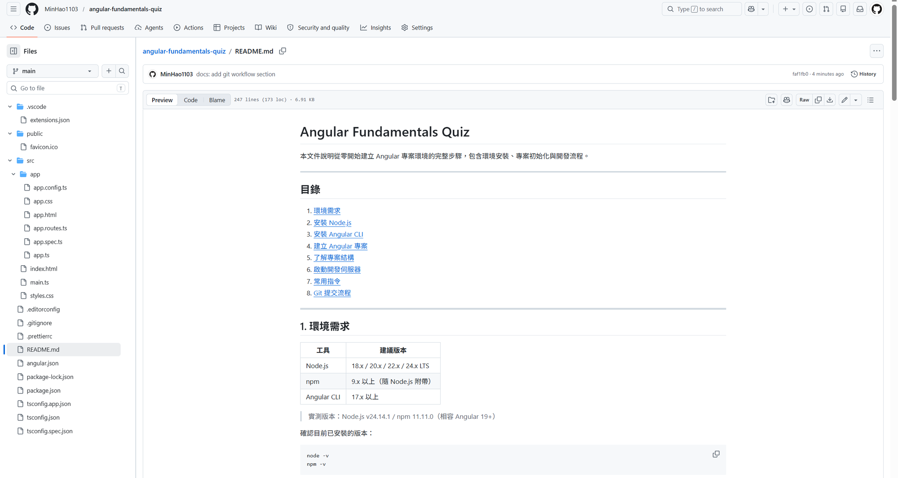

# Angular Fundamentals Quiz

本文件說明從零開始建立 Angular 專案環境的完整步驟，包含環境安裝、專案初始化與開發流程。

---

## 目錄

1. [環境需求](#1-環境需求)
2. [安裝 Node.js](#2-安裝-nodejs)
3. [安裝 Angular CLI](#3-安裝-angular-cli)
4. [建立 Angular 專案](#4-建立-angular-專案)
5. [了解專案結構](#5-了解專案結構)
6. [啟動開發伺服器](#6-啟動開發伺服器)
7. [常用指令](#7-常用指令)

---

## 1. 環境需求

| 工具 | 建議版本 |
|------|----------|
| Node.js | 18.x / 20.x / 22.x / 24.x LTS |
| npm | 9.x 以上（隨 Node.js 附帶） |
| Angular CLI | 17.x 以上 |

> 實測版本：Node.js v24.14.1 / npm 11.11.0（相容 Angular 19+）

確認目前已安裝的版本：

```bash
node -v
npm -v
```

---

## 2. 安裝 Node.js

若尚未安裝 Node.js，請至官網下載 LTS 版本：

```
https://nodejs.org/
```

安裝完成後，重新開啟終端機並確認版本：

```bash
node -v
npm -v
```

---

## 3. 安裝 Angular CLI

使用 npm 全域安裝 Angular CLI：

```bash
npm install -g @angular/cli
```

確認安裝成功：

```bash
ng version
```

> **Windows 注意事項**：若出現 `ng : 無法載入檔案...` 的執行原則錯誤，請以**系統管理員**身份開啟 PowerShell 並執行：
> ```powershell
> Set-ExecutionPolicy -Scope CurrentUser -ExecutionPolicy RemoteSigned
> ```

---

## 4. 建立 Angular 專案

進入你想放置專案的目錄，執行以下指令：

```bash
ng new angular-fundamentals-quiz
```

CLI 會詢問幾個設定選項：

| 問題 | 建議選擇 |
|------|----------|
| Share pseudonymous usage data with Angular Team? | 直接按 `Enter`（預設 `N`，拒絕回傳統計資料，不影響功能） |
| Which stylesheet system would you like to use? | 選 `CSS`（原生 CSS，最簡單，初學不需預處理器） |
| Do you want to enable SSR and SSG/Prerendering? | 直接按 `Enter`（預設 `N`） |
| Which AI tools do you want to configure? | 用 `空白鍵` 選 `Claude`，再按 `Enter`（使用 Claude Code 開發時建議選此項） |

> Angular 17+ 預設使用 **Standalone Components**（不使用 NgModule），本專案採用此架構。

### 為什麼不需要 SSR / SSG？

Angular 預設是 **SPA（單頁應用程式）**，HTML 由瀏覽器端的 JavaScript 渲染。這對搜尋引擎爬蟲不友善，因為爬蟲拿到的頁面幾乎是空的。

| 技術 | 運作方式 | 適合情境 |
|------|----------|----------|
| **SSR** | 每次請求由伺服器動態產生完整 HTML | 需要 SEO 的電商、部落格 |
| **SSG** | 打包時預先產生靜態 HTML 檔案 | 內容固定的說明文件、官網 |
| **SPA（預設）** | HTML 由瀏覽器執行 JS 後渲染 | 需登入操作的互動應用 |

本專案是使用者操作的 Quiz 互動頁面，不需要被搜尋引擎收錄，選預設 `N` 即可。

建立完成後進入專案目錄：

```bash
cd angular-fundamentals-quiz
```

---

## 5. 了解專案結構



```
angular-fundamentals-quiz/
├── .vscode/
│   └── extensions.json
├── public/
│   └── favicon.ico
├── src/
│   ├── app/
│   │   ├── app.config.ts
│   │   ├── app.css
│   │   ├── app.html
│   │   ├── app.routes.ts
│   │   ├── app.spec.ts
│   │   └── app.ts
│   ├── index.html
│   ├── main.ts
│   └── styles.css
├── .editorconfig
├── .gitignore
├── .prettierrc
├── angular.json
├── package-lock.json
├── package.json
├── tsconfig.app.json
├── tsconfig.json
└── tsconfig.spec.json
```

### 各檔案說明

**`src/app/`** — 應用程式核心，主要開發工作都在這裡

| 檔案 | 功能 |
|------|------|
| `app.ts` | 根元件邏輯，整個應用程式的起點元件 |
| `app.html` | 根元件的 HTML 模板 |
| `app.css` | 根元件的樣式，只作用於此元件 |
| `app.config.ts` | 應用程式層級設定，包含路由、providers 等注入設定 |
| `app.routes.ts` | 定義所有頁面路由規則 |
| `app.spec.ts` | 根元件的單元測試檔案 |

**`src/`** — 應用程式進入點

| 檔案 | 功能 |
|------|------|
| `index.html` | 唯一的 HTML 頁面，Angular 渲染結果會注入至此 |
| `main.ts` | 程式啟動點，呼叫 `bootstrapApplication` 啟動 Angular |
| `styles.css` | 全域樣式，作用於整個應用程式 |

**`public/`** — 靜態資源

| 檔案 | 功能 |
|------|------|
| `favicon.ico` | 瀏覽器分頁上顯示的小圖示 |

**專案根目錄** — 設定檔

| 檔案 | 功能 |
|------|------|
| `angular.json` | Angular CLI 設定，包含建置、測試、lint 的各項參數 |
| `package.json` | npm 套件清單，記錄專案依賴與可執行的指令 |
| `package-lock.json` | 鎖定所有套件的確切版本，確保每台機器安裝結果一致 |
| `tsconfig.json` | TypeScript 編譯設定（基底） |
| `tsconfig.app.json` | 繼承基底設定，針對應用程式原始碼的編譯設定 |
| `tsconfig.spec.json` | 繼承基底設定，針對測試檔案的編譯設定 |
| `.editorconfig` | 統一不同編輯器的縮排、換行等格式設定 |
| `.prettierrc` | Prettier 程式碼排版規則 |
| `.gitignore` | 指定不需要上傳至 Git 的檔案與資料夾 |

**`.vscode/`** — VS Code 設定

| 檔案 | 功能 |
|------|------|
| `extensions.json` | 推薦安裝的 VS Code 擴充套件清單 |

---

## 6. 啟動開發伺服器

```bash
ng serve
```

開啟瀏覽器，前往：

```
http://localhost:4200
```

> 修改任何原始碼後，瀏覽器會**自動熱更新**，無需手動重新整理。

---

## 7. 常用指令

| 指令 | 說明 |
|------|------|
| `ng serve` | 啟動開發伺服器 |
| `ng build` | 打包正式版本（輸出至 `dist/`） |
| `ng generate component <名稱>` | 產生新元件 |
| `ng generate service <名稱>` | 產生新服務 |
| `ng test` | 執行單元測試 |
| `ng lint` | 執行程式碼檢查 |

產生元件的簡寫範例：

```bash
ng g c quiz        # 建立 quiz 元件
ng g c quiz/question  # 在 quiz 目錄下建立 question 元件
```


---

## 已知問題與解決方式

### 問題 1：`ng serve` 出現 "This command is not available when running the Angular CLI outside a workspace"

**原因：** 在已有同名資料夾的目錄下執行 `ng new angular-fundamentals-quiz`，CLI 會再建立一層同名子資料夾，造成雙層巢狀結構：

```
D:\angular-fundamentals-quiz\                  ← git 根目錄
└── angular-fundamentals-quiz\                 ← ng new 建立的 Angular 專案
    ├── src\
    ├── angular.json
    └── ...
```

**解決方式：** 將內層所有 Angular 檔案搬移至外層根目錄，合併為單層結構。

```powershell
# 移動無衝突項目（在 PowerShell 執行）
$items = @('.gemini', '.vscode', 'node_modules', 'public', 'src', '.editorconfig', '.prettierrc', 'angular.json', 'package-lock.json', 'package.json', 'tsconfig.app.json', 'tsconfig.json', 'tsconfig.spec.json')
foreach ($item in $items) {
    Move-Item -Path ".\angular-fundamentals-quiz\$item" -Destination ".\$item" -Force
}

# 用內層 Angular 專用的 .gitignore 取代外層通用版
Move-Item -Path ".\angular-fundamentals-quiz\.gitignore" -Destination ".\.gitignore" -Force

# 刪除已清空的內層資料夾
Remove-Item -Path ".\angular-fundamentals-quiz" -Recurse -Force
```

**預防方式：** 日後若要在現有資料夾內初始化 Angular，請改用：

```bash
ng new . --skip-git
```

這樣 CLI 會直接在當前目錄建立專案，不會新增子資料夾。
